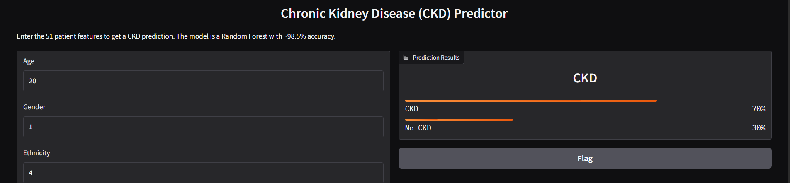
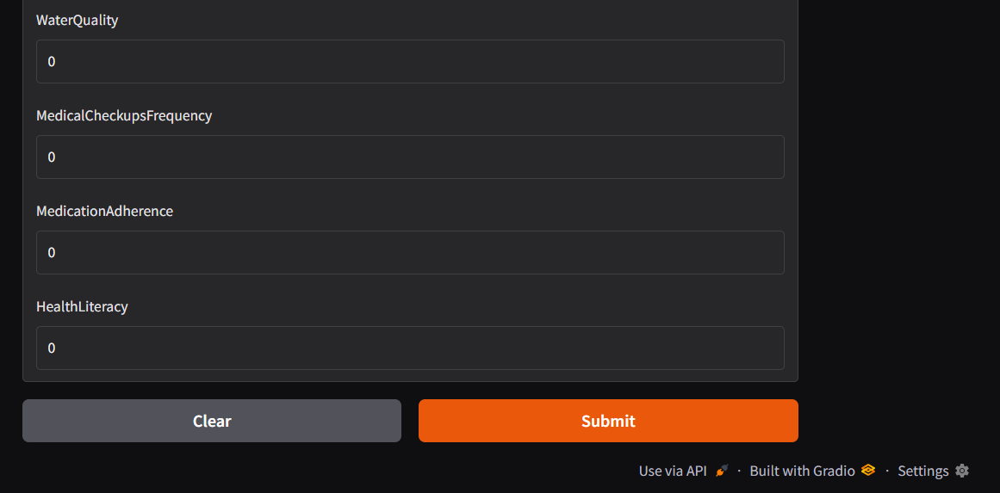

<h1 align="center">Chronic Kidney Disease (CKD) Prediction System</h1>

  
   
  <em>Figure 1: UI 1 </em>

  
   
  <em>Figure 2: UI 2</em>

📋 Overview

This repository contains a specialized Machine Learning system designed for the early detection of Chronic Kidney Disease (CKD). The project focuses on the implementation of a Random Forest Classifier, which was selected for its superior ability to handle complex clinical data and its high diagnostic reliability.

🌲 Why Random Forest?

The Random Forest algorithm was chosen as the primary model due to several key advantages identified during development:

High Diagnostic Accuracy: Achieved an overall accuracy of 98.03%.
Robustness: Effectively handles high-dimensional data (51 features) without significant overfitting when combined with proper scaling.
Clinical Reliability: Optimized for a 97.38% Recall, ensuring that very few true CKD cases are missed by the system.

📊 Model Performance

Metric                 Score
Accuracy               98.03%
Precision              98.67%
Recall (Sensitivity)   97.38%
F1-Score               98.02%
AUC Score              0.9993

🛠️ Project Architecture

1.Preprocessing: Includes Standard Scaling for feature normalization and SMOTE to balance the training classes (1,219 samples per class).
2.Model: A RandomForestClassifier trained with random_state=42 for reproducibility.
3.Deployment: A real-time web interface built with Gradio, allowing users to input 51 clinical parameters for instant results.

📂 Key Files

CKD_App/app.py: The Gradio web application script.
ckd_model.pkl: The serialized Random Forest model.
ckd_scaler.pkl: The StandardScaler used for input normalization.
Chronic_Kidney_Dsease_data.csv: The raw dataset containing 1,659 patient records.

🚀 Getting Started

1.Clone the Repo:
git clone https://github.com/yourusername/CKD-Predictor-RandomForest.git

2.Install Dependencies:
pip install gradio joblib numpy pandas scikit-learn

3.Launch the Predictor:
python CKD_App/app.py

The Random Forest model was trained on a balanced dataset (using SMOTE) and evaluated using the following metrics:
